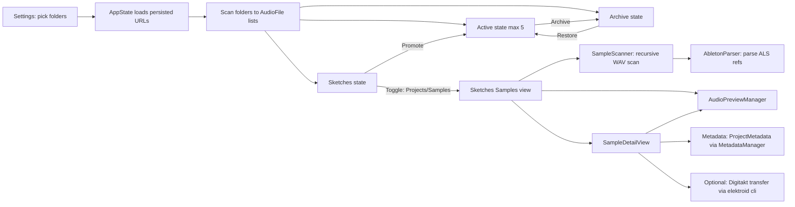
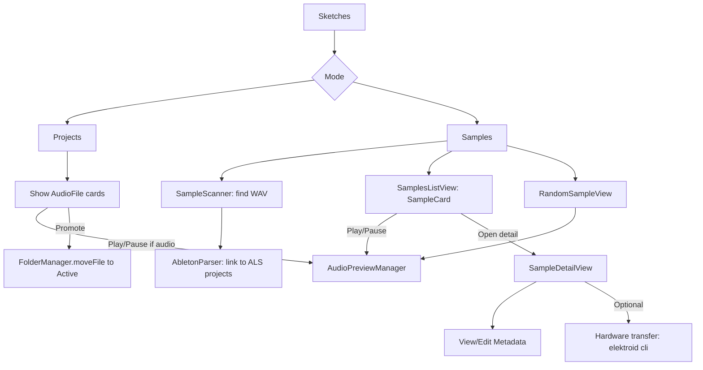
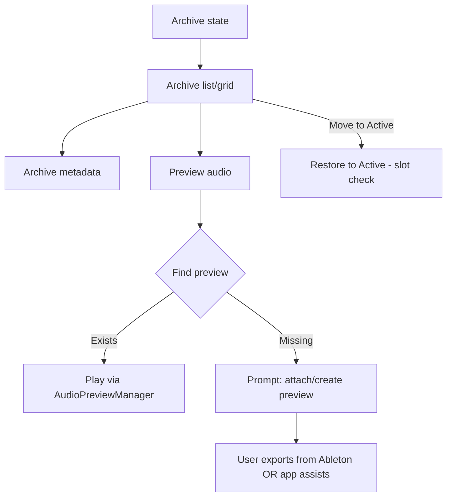
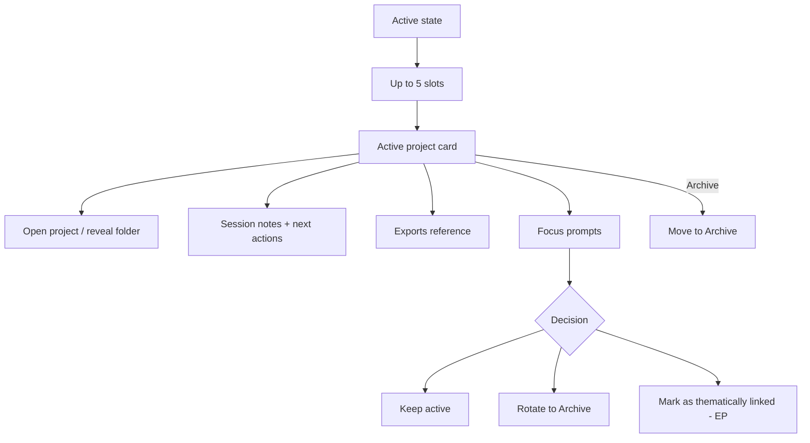

# FlowForge Roadmap (living document)

## Abstract

FlowForge is a macOS-native, folder-backed workflow tool for managing music-making work across three creative states:

- **Sketches**: capture and explore raw ideas (unlimited)
- **Active**: focus execution with a hard cap of **5** projects at a time
- **Archive**: store completed / paused work and intentionally resurface it for inspiration

FlowForge’s “database” is the file system: the truth is whatever is inside the user-selected folders.

## Current goal of the app (as it stands)

Make it effortless to:

1. Point FlowForge at three folders (Sketches / Active / Archive)
2. See real files in each state
3. Move items between states with guardrails (Active max 5)
4. In Sketches, audition audio quickly and curate a working set

Secondarily (already in progress in this codebase): treat Sketches as both **Projects** and **Samples**, with deeper sample tooling (preview, metadata, “random sample” window, and optional hardware transfer).

---

## System overview (implemented)

### Key code entry points (as of this codebase)

- UI state routing: `BLOWBORG/flowforge/ContentView.swift`
- Global state + persistence: `BLOWBORG/flowforge/Models/AppState.swift`
- Folder selection/scanning/moves: `BLOWBORG/flowforge/Services/FolderManager.swift`
- Sketches samples scan + Ableton linking:
  - `BLOWBORG/flowforge/Services/SampleScanner.swift`
  - `BLOWBORG/flowforge/Services/AbletonParser.swift`
- Audio preview engine: `BLOWBORG/flowforge/Services/AudioPreviewManager.swift`
- Sample UX:
  - `BLOWBORG/flowforge/Views/SamplesListView.swift`
  - `BLOWBORG/flowforge/Views/SampleDetailView.swift`
  - `BLOWBORG/flowforge/Views/RandomSampleView.swift`

### Metadata + preview persistence (implemented foundation)

- Metadata is persisted as JSON under `~/Library/Application Support/FlowForge/metadata/`.
- Preview files are stored under `~/Library/Application Support/FlowForge/previews/<project-uuid>/`.
- The model supports notes, tags, rating, BPM/key/genre, archive prompts, and preview history (`PreviewSnapshot`).

Historical phase planning docs have been archived under `COMPLETED_ROADMAP/`.
Phase completion tracking lives in `COMPLETED_ROADMAP/ARCHIVE.md`.
Proof Test Sweep is defined in `TEST_SWEEP.md` and gates phase transitions.

---

## Status snapshot (what the codebase currently supports)

This section is meant to reflect the *actual behavior* of the repo, not aspirational goals.

### Cross-cutting

- Folder-backed workflow (no DB)
- Three workflow states and full-screen switching
- Persisted folder URLs + default state
- File operations (move between folders)
- Active slot cap enforced (max 5)

### Sketches

**Projects mode**

- List/grid cards for files in Sketches
- Promote to Active
- Audio preview for audio files in Sketches file cards

**Samples mode (Sketches)**

- Recursive scan for `.wav`
- Parse Ableton `.als` to link samples to projects (best-effort)
- Audio preview in list + detail view
- Random sample selector window
- Metadata object exists and is editable/creatable (basic)
- Digitakt transfer (Elektroid) is **wired end‑to‑end**:
  - UI: “Transfer to Digitakt” in `RandomSampleView` + `SampleDetailView`
  - Settings: user-selected `elektroid-cli` + diagnostics + sandbox probe + “fix permissions”
  - Transfer path: stage → optional trim-to-export → upload → list/verify
  - Destination: `/samples/SKETCHS`
  - Exit code is the success signal; stderr warnings are non-fatal
- Sample trim + preflight (Sketches):
  - Trim start/end persisted per sample
  - Preview playback respects trim endpoints
  - Trim-to-export enabled for transfers (temp mono export + optional fades)
  - Preflight shows duration/size/format + warnings (>30s, >64MB)

### Archive

- Basic list of files
- Restore to Active
- No dedicated preview collection UX yet
- No Archive-specific metadata flows yet

### Active

- Basic list of up to 5 items + empty slot placeholders
- Archive action
- No “focus” prompt system yet
- No export management UX yet

---

## Roadmap philosophy (reworked)

Rather than “Phase 2 = polish” generically, the next work is organized by **state maturity**:

1. **Sketches first**: get a stable, delightful daily driver
2. **Archive next**: build the library and preview/curation loop
3. **Active last**: design the high-stakes focus system around a max of 5

Each state below includes:

- A functional diagram
- “Definition of done” (what “bug free” means)
- Next-step feature ideas
- Suggested Git/GitHub workflow checkpoints

---

## Phase S (current): Sketches state hardening + “daily driver” quality

### Goal

Make Sketches the place you can live in every day:

- Fast scan, reliable preview, clear affordances
- Low-friction triage into Active
- Solid Samples sub-workflow without crashes or confusing states

### Baseline summary (before this hardening cycle)

- Sketches Projects/Samples views are in place with scanning + preview
- Sample metadata exists and is editable
- Digitakt transfer is wired end-to-end (stage → trim → upload → verify) to `/samples/SKETCHS`
- Elektroid CLI diagnostics + routing checks are available in Settings and Sample Detail
- Preflight warnings exist for >30s duration and >64MB size

### Sketches functionality diagram

### Definition of done (Sketches)

“Functional + bug free” for Sketches means:

- Scanning does not hang the UI and does not silently fail
- Audio preview works reliably for common formats and stops when switching files
- Samples mode handles missing references / iCloud placeholders gracefully
- Moving files (Promote) always results in correct file placement and UI refresh
- Errors that affect the user are visible in UI (not only console)

### Phase gate: Proof Test Sweep (commit gate)

- Run `TEST_SWEEP.md` after significant changes that warrant a commit
- Passing the sweep is required to exit Phase S and enter Phase R
- Record the pass in `COMPLETED_ROADMAP/ARCHIVE.md`

### Transfer edge-case test plan (commit gate detail)

Run these in order after any significant transfer changes (mirrors `TEST_SWEEP.md`):

1. Short sample (<10s): transfer and verify it appears in `/samples/SKETCHS`.
2. Duplicate file: transfer same file again → prompt shows → choose Overwrite (skip upload, keep existing).
3. Long sample (>30s): confirm warning → attempt transfer blocked with alert → trim to <=30s → transfer succeeds.
4. Disconnected device: unplug Digitakt → transfer shows clean error and no crash.
5. Oversized sample (>64MB): confirm warning → transfer should fail gracefully or be canceled.
6. Wrong USB mode: set Digitakt to Overbridge → routing issue message appears.
7. Folder creation: delete `/samples/SKETCHS` on device → transfer recreates folder and uploads.
8. Filename edge case: transfer a file with spaces/uppercase → verify shows correct name.
9. Reconnect flow: unplug/replug Digitakt → transfer works without app restart.

### Prioritized work items (Sketches)

1. **User-visible error reporting** (Sketches first)
   - Surface scan errors and move errors in a consistent UI pattern
2. **File conflict resolution**
   - If destination already has a file with same name: Rename / Replace / Skip
3. **Preview ergonomics**
   - (Optional) spacebar play/pause
   - quick “reveal in Finder” and “open” actions everywhere
4. **Samples: quality and metadata loop**
   - tighten metadata editing UX (single editor sheet, consistent fields)
   - (Optional) persist notes from RandomSampleView into metadata
5. **Waveform preview + trim (in progress)**
   - Trim start/end persisted per sample (metadata)
   - Preview playback uses trim endpoints (default 3s padding if available)
   - Trim-to-export implemented (temp mono export + fade toggles)
   - **Remaining**: waveform UI in Sample Detail + Random Sample views
6. **Hardware integration (optional)**
   - treat as “experimental”: must not block core Sketches UX
  - **Digitakt transfer (Elektroid) – target design (sandboxed, minimalist, user-installed CLI)**
    - **User installs `elektroid-cli` themselves** (FlowForge does not bundle it)
    - **Settings-driven CLI selection**
      - User selects the `elektroid-cli` executable via file picker
      - Persist a **security-scoped bookmark** so it works after relaunch
      - **Sandbox note (selection failures)**:
        - Selecting `/usr/local/bin/elektroid-cli` can fail with a generic “couldn’t be opened” error if **app‑scoped bookmarks** entitlement is missing
        - Ensure entitlement `com.apple.security.files.bookmarks.app-scope` is enabled for sandboxed builds
        - Immediate workaround: copy the binary under `~/bin` (or any home folder path) and select that copy
      - PATH/common-path detection is only a fallback
    - **Sandbox-safe file staging (required)**
      - Before upload, FlowForge copies the sample into the app container temp directory and passes that staged path to `elektroid-cli`
      - Rationale: security-scoped access granted to FlowForge does not reliably extend to child processes
	    - **Success semantics**
	      - Use **exit code** as the success signal
	      - Capture stdout/stderr; do **not** treat “any stderr output” (e.g. RtAudio channel-count warnings) as failure if exit code is 0
	    - **Device targeting (minimal)**
	      - Auto-detect the first device whose name contains “Digitakt”
	      - If multiple endpoints appear, later add a simple picker
	  - **Digitakt transfer (Elektroid) – implementation steps**
	    1. Add Settings section to select/clear `elektroid-cli` (bookmark persistence)
	    2. Add diagnostics + sandbox probe + “fix permissions”
	    3. Stage files into container temp directory
	    4. Trim-to-export (mono) + optional fade-in/out before upload
	    5. Define “working” acceptance criteria:
	       - Click “Transfer to Digitakt” → device detected → file uploaded to `/samples/SKETCHS` → success confirmation; any RtAudio warnings do not block success

### Possible additions (Sketches)

- Filter/search in Samples list
- “Shortlist” / “starred” samples
- “Promote as project” (create new project folder from sample selection)
- Batch operations (multi-select promote / reveal / tag)

### Git/GitHub workflow checkpoints (Sketches)

1. Create a GitHub Project (board)
   - Columns: Backlog → Ready → In progress → In review → Done
   - Labels: `sketches`, `archive`, `active`, `bug`, `ux`, `tech-debt`
2. For each feature:
   - Create an issue (1 feature = 1 issue)
   - Create a branch: `sketches/<short-name>`
   - Commit small slices with messages like `Sketches: add conflict dialog`
   - Open a PR, link the issue, move card across the board
   - Merge after local tests/build pass

Note: FlowForge should not require network access or paid services for core functionality.

---

## Phase R (next): Archive state as the inspiration library

### Goal

Archive becomes a curated library of unfinished and finished work, each with a quick preview so resurfacing is effortless.

### Archive functionality diagram (target)

### Preview collection for Ableton projects (key feature)

We need a reliable way to associate a project with a preview audio file.

Recommended approach (simple and robust):

- Each archived project can have an optional **preview file** stored in a predictable place:
  - Example: `ProjectName/FlowForge Preview.wav` or `ProjectName/Previews/preview.wav`
- Archive UI shows:
  - “Preview found” (play button)
  - or “No preview” (CTA to attach/create)

Possible enhancements (exploratory; do not block Phase R):

- Offer a “Set preview file…” button (user picks any audio file)
- Attempt to *infer* the preview by looking for an export folder pattern
- Investigate deeper Ableton interpretation (reading `.als`) as a helper, not a requirement
- Consider MCP-style tooling only if it reduces friction without adding fragility (note only)

**Foreshadowing for Active**: after each Active session, FlowForge could prompt to export/update a preview, which then becomes the Archive preview when the project is archived.

### Required UX actions (Archive)

- Restore to Active (already exists; keep slot check)
- “Move to Active” button in each archive card (explicit, discoverable)
- Preview play/pause if preview exists
- Clear empty-state instructions

### Stretch goals (Phase R)

#### Apple Intelligence voice capture for metadata (cross-view)

Add a low-friction way to speak *into* FlowForge from anywhere you’re already working:

- **Entry points**: mic button in Project detail, Sample detail, and “Focused project” views.
- **Primary behavior**: capture a short spoken update → **transcribe** → append to **freeform notes**.
- **Secondary behavior (optional)**: run an on-device “Apple Intelligence” pass that tries to extract **hard metadata** if explicitly mentioned:
  - BPM, key, time signature, feel, tags, instruments, “next action” checklist.
- **Merge rules (important)**:
  - Treat the transcript as the source for notes; notes can be rewritten/condensed as the dialogue evolves.
  - Only update structured fields (BPM/key/time sig/etc.) when the new transcript *explicitly* provides them.
  - Otherwise preserve the previous structured metadata unchanged.
  - If extraction conflicts with existing metadata, show a small confirm UI (“Keep existing” vs “Update to new”).
- **Fallback**: if Apple Intelligence isn’t available, still support dictation → notes-only.

### Four additional ideas for Archive

1. **Resurface cadence**: “Resurface 1 archived project per week” queue
2. **Tagging + search**: tags like `ambient`, `drums`, `ep-candidate`, `needs-vocals`
3. **Version snapshots**: lightweight “milestone” notes + linked preview versions
4. **Archive health signals**: show “last touched”, preview age, and a gentle “revive?” CTA

### Git/GitHub workflow checkpoints (Archive)

- Create an epic issue: “Archive preview system”
- Sub-issues:
  - Preview detection rules
  - Archive card UI updates
  - Attach/create preview UX
  - Metadata in archive context

---

## Phase A (after Archive): Active state focus system (max 5 projects)

### Goal

Active is a deliberately constrained workspace: **maximum 5 projects**.

It should help you:

- Decide what stays in focus
- Rotate out what isn’t getting traction
- Group work thematically (e.g., “EP candidates”)
- Keep exports discoverable

### Active functionality diagram (target)

### Design constraints (non-negotiable)

- Active must never exceed 5 items.
- Every UI affordance should reinforce “limited slots” (visual empty-slot cards are good).
- Any “Restore from Archive” must respect slot count.

### Export audio management (foreshadowing)

Two viable approaches:

1. **Reference folder approach (recommended first)**
   - User configures an “Ableton Exports” folder path in settings
   - Active cards can reveal that folder, optionally filtered by project name
   - FlowForge does not attempt to run Ableton exports

2. **Button-assisted export (future)**
   - A button that opens the project and guides export steps
   - Or uses AppleScript/shortcuts if stable (risk: brittle)

### Focus prompt system (concept)

- After N days without activity: prompt “Is this still active?”
- When slots are full and you try to promote/restore:
  - prompt to archive one project first
- Thematic prompts:
  - “Do any of these belong together as an EP?”
  - “Pick 1 primary, 2 secondary, 2 parking-lot”

### Git/GitHub workflow checkpoints (Active)

- Epic: “Active focus system (max 5)”
- Sub-issues:
  - Slot UX polish
  - Focus prompt rules + storage
  - Export folder reference wiring
  - Archive/restore ergonomics

---

## Additional phases / context for AI to recreate FlowForge from this roadmap

### Architecture invariants

- The file system is the source of truth (avoid hidden DB requirements)
- `AppState` is the single observable state owner; views read from it
- Services should be deterministic and testable (FolderManager, scanners, parsers)
- UI must always handle “folder not configured” states

### Likely hiccups (known risk areas)

- macOS security-scoped bookmarks / sandboxing (if/when sandboxing is enabled)
- iCloud files that look present but are not downloaded
- Long recursive scans (Samples) blocking UI if not carefully scheduled
- File conflicts and partial failures during move operations
- Audio preview edge cases (unsupported formats, simultaneous playback)

### Codebase structuring improvements (recommended)

- Consolidate user-facing error handling (one pattern, one place)
- Introduce a small “domain layer” for operations:
  - `MoveOperation`, `ConflictResolution`, `PreviewAssociation`
- Separate “project files” vs “audio samples” concepts more clearly in models
- Add lightweight tests for:
  - conflict resolution naming
  - folder scanning filters
  - Ableton parsing (fixture-based)

### Make it more “flowy” (product direction)

- Keyboard-first navigation in Sketches/Samples
- Gentle prompts instead of nagging dialogs
- Minimal chrome: emphasize content cards and clear actions
- One-click “resurface” action from Archive to Active
- A “Flow mode” that encourages serendipity (RandomSampleView as seed)

---

## Mac App Store sandboxing (final phase; not yet)

Context note: target **Mac App Store sandboxing last**, after core UX is stable. For now, use **local sandboxed builds** for spot checks and entitlement validation.

---

## GitHub Projects + commit/push cadence (operational checklist)

1. Create a GitHub repository (if not already)
2. Create a GitHub Project board
3. For each phase:
   - Create an epic issue
   - Break into 3–8 child issues (each ~30–90 minutes)
   - Work in short branches
   - Commit early and often
   - Push branches and open PRs
   - Update this roadmap after closing an epic (keep it honest)

Important: committing/pushing is intentionally manual and deliberate. The roadmap should document the expected workflow, but the developer chooses when to execute it.
